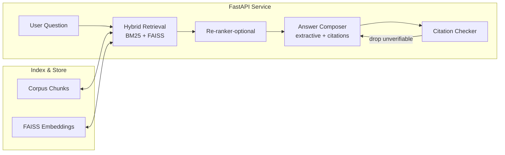

# Prod-Grade RAG (Simple, Measurable, Trustworthy)

A **production-minded RAG starter**:
- Trustworthy answers with **citations**
- **Hybrid retrieval** (BM25 + Embeddings + FAISS) + optional re-ranker
- **Caching**, **Prometheus /metrics**
- **Evaluation**: RAGAS (context precision, faithfulness) + a simple citation-precision harness
- **FastAPI API**

## Architecture


## Quickstart
```bash
python -m venv enterprise-grad-rag && source enterprise-grad-rag/bin/activate
pip install -r requirements.txt
python -m app.index build
uvicorn app.main:app --reload
curl -s -X POST http://localhost:8000/answer -H "Content-Type: application/json" -d '{"question":"What are the controls for customer data access?"}'
```

## Evaluate
```bash
python -m app.eval --k 5         # simple citation precision + latency
python -m app.eval_ragas --k 5   # RAGAS: context_precision, faithfulness
```

## Prometheus
- Scrape **/metrics** for `rag_requests_total`, `rag_errors_total`, `rag_answer_latency_seconds`.

## Vector DB
- **FAISS** local by default; **pgvector** stub included (see `app/vectorstore.py`).
