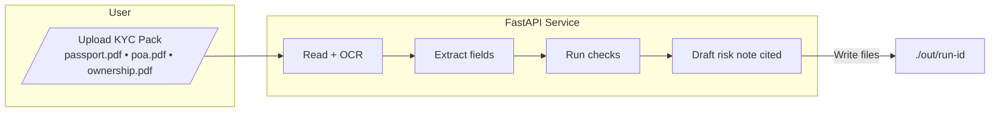

# KYC Intake & Risk Note 

A **beginner-friendly** demo that reads a small KYC pack, extracts a few facts, runs simple checks,
and drafts a short **risk note** with **citations** to the source files. Now with **PDF samples** and **basic OCR**.


> Place your exported diagram at `docs/kyc-workflow-arch.png`. The app flow and steps below match the diagram.

## Inputs and Outputs
- Inputs: `passport.pdf`, `poa.pdf`, `ownership.pdf` (samples included)
- Outputs: `out/<run-id>/profile.json`, `checklist.json`, `risk_note.md`

## Simple design (Mermaid)


## Run
```bash
python -m venv .venv && source .venv/bin/activate
pip install -r requirements.txt
uvicorn api.main:app --reload
# UI: http://localhost:8000
```

## OCR
Install Poppler + Tesseract for OCR (see README full variant in earlier message).
