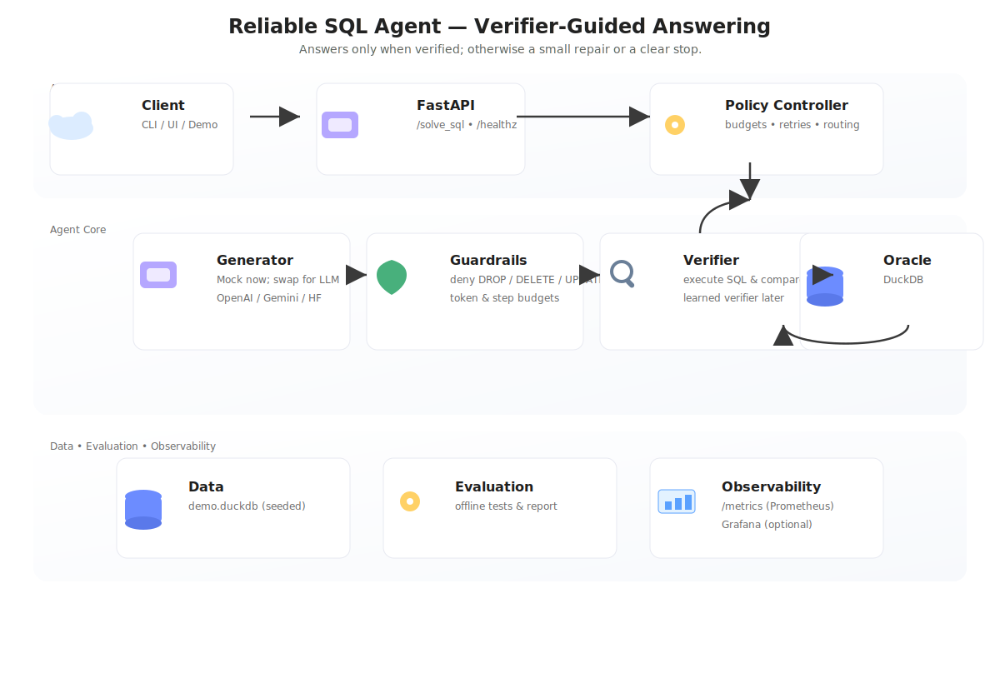

# Reliable SQL Agent (Simple, Verifier-Guided)

**Problem:** AI agents can return answers that look right but are wrong.  
**Goal:** Return an answer **only if we can verify it**. If not, try a tiny repair or say we don’t know—within a fixed budget.

This tiny repo solves simple analytics questions by:
1) Generating SQL
2) Blocking unsafe SQL (guardrails)
3) Executing SQL to **verify** the result
4) Returning the answer only if it passes the check; otherwise a quick, limited retry

No API keys required. You can plug in a real LLM later.

---

## How it works (30 seconds)

```
User Question
     │
     ▼
HTTP API (/solve_sql)
     │
     ▼
Agent
 ├─ Generate SQL (mock LLM for demo)
 ├─ Guardrails (block DROP/DELETE/etc.)
 ├─ Verify by running SQL on DuckDB
 └─ If verified → return answer
      else → small repair or stop
```



---

## Run it

```bash
pip install -r requirements.txt
python data/seed_duckdb.py
uvicorn api.main:app --reload

# then in another shell:
curl -X POST localhost:8000/solve_sql -H "Content-Type: application/json"   -d '{"question":"Top 3 customers by spend in 2023"}'
```

Optional: quick evaluation
```bash
python eval/run_eval.py
# writes reports/summary.json
```

---

## What to look at

- `api/main.py` – single endpoint
- `agent/policy.py` – guardrails + limited retry + verification
- `agent/generator.py` – mock SQL generator (swap later for a real LLM)
- `agent/oracle_sql.py` – executes SQL and returns rows
- `data/seed_duckdb.py` – tiny demo database
- `eval/run_eval.py` – small test harness

---

## Swap in a real LLM (later)

Add your provider call inside `agent/generator.py` to produce SQL. Keep verification in place so answers are always checked.
